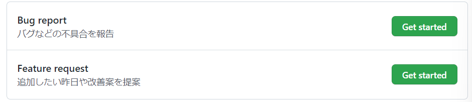
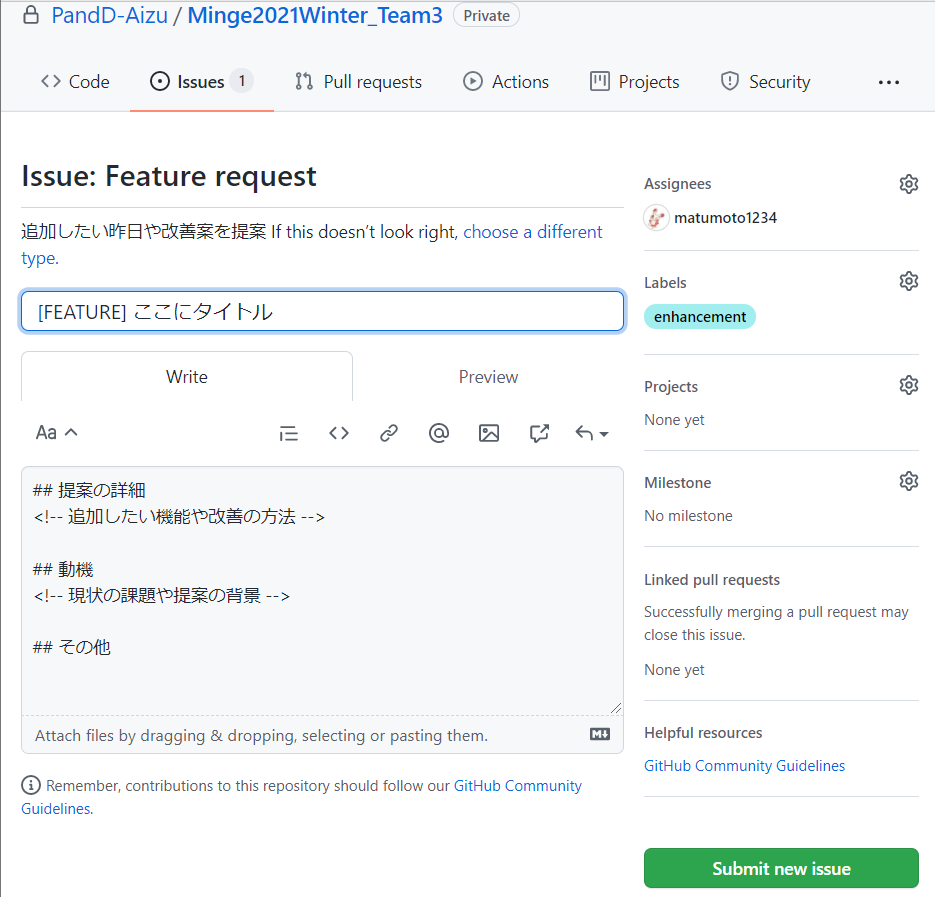
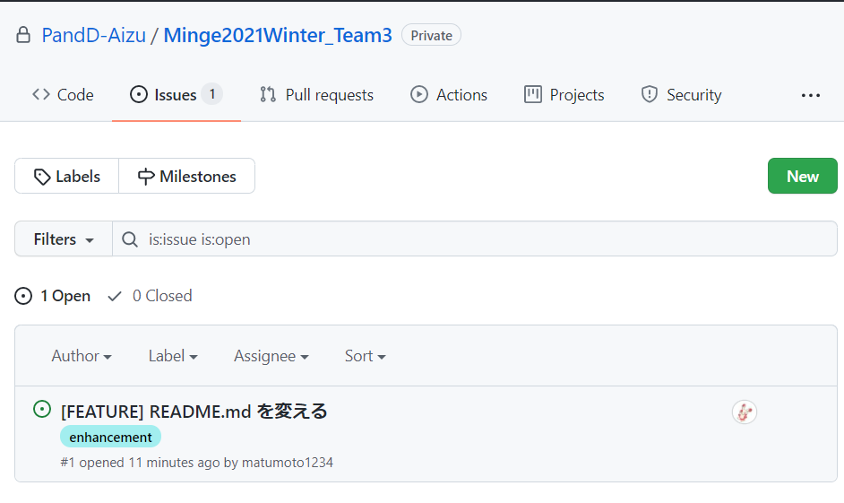
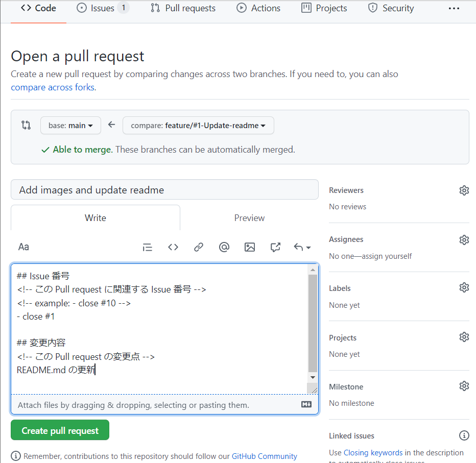

# Minge2021Winter_Team3
2021冬みんげーチーム3


## GitHub の使い方

### Issue を作るとき

1. New issue ボタンを押す

`ISSUE_TEMPLATE` が用意されているため、次のような画面に移る。作りたい方の issue を作る。




2. Feature request の Get started ボタンを押す

次のような画面になる。

`[FEATURE]` は消さずにタイトルを入力し、提案の詳細などをその下の入力欄に書き入れる。

入力し終わったら `Submit new issue` ボタンを押す。



3. 作られているか確認する

次のように作られていればOK




### ブランチの命名規則

- feature の場合
  `feature/#ここにissue番号/issueの内容`
- bug の場合
  `bug/#ここにissue番号/issueの内容`

例.
- `feature/#1/update-readme`
- `bug/#2/fix-hoge-file`


ローカルで行うこと
```bash
# ブランチを作る(シングルクォーテーションは環境によってはいらないかも)
git branch 'feature/#1/update-readme'
# 作ったブランチに移動する(シングルクォーテーションは環境によってはいらないかも)
git checkout 'feature/#1/update-readme'
```


### `git push` をするとき
`git add` して `git commit` したあと。

自分の作業しているブランチと同じ名前のリモートブランチに`push`する。

```bash
git push origin ブランチ名

# 例
# git push origin feature/#1/update-readme
```


### Pull request を作るとき

※なにかを更新したとき前提

1. push すると以下のような緑色の表示が出てくる


2. Compare & pull request を押す

タイトルをいい感じに日本語に直す

例.

- `README.md の修正`


下の入力欄に変更内容などを入力する  
出来たら `Create pull request` を押す




